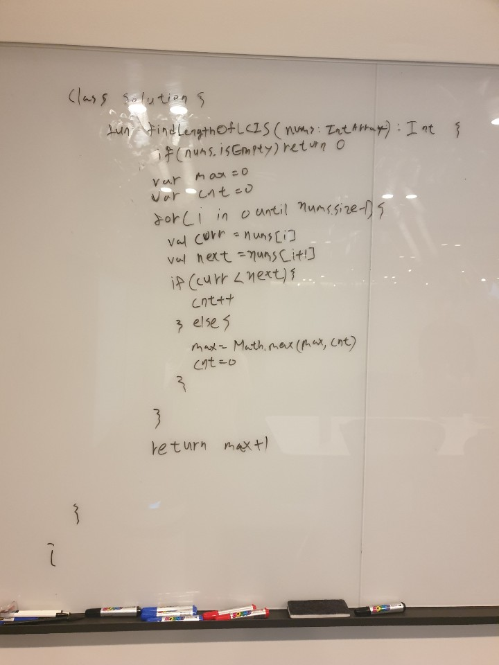
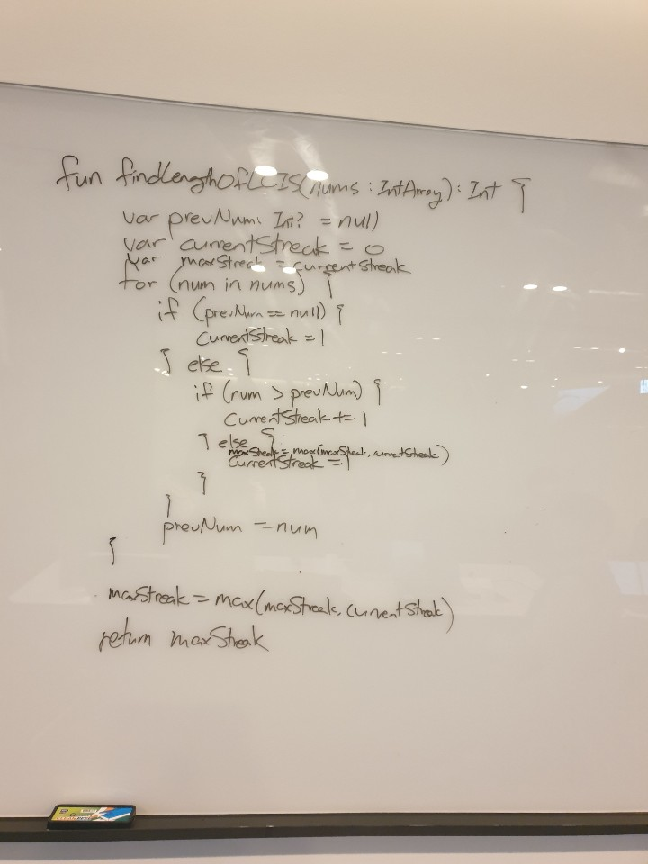
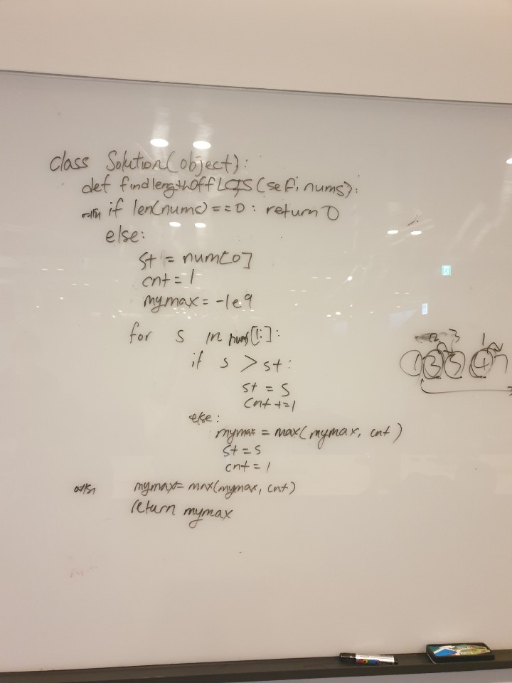
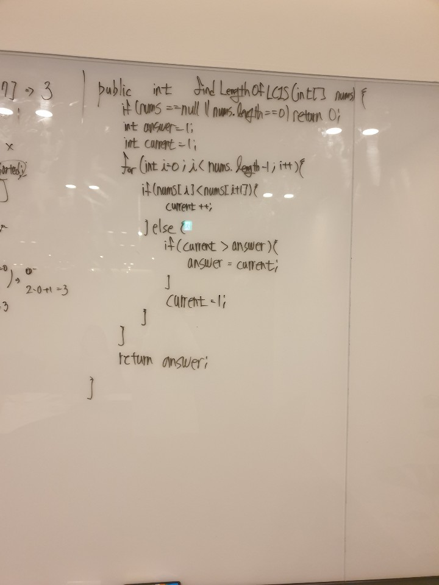

# 674. Longest Continuous Increasing Subsequence

출제자: 스텔라

[Link](https://leetcode.com/problems/longest-continuous-increasing-subsequence/)

- 출제 이유
  - 쉬우면서도 생각을 많이 할수록 깔끔한 답을 낼 수 있는 문제를 내보고싶었다.

## Latte


- Time complexity: O(n)
- Space commplexity: O(1)

문제를 처음 마주하고 엄청 쉽다고 생각했고 약간 방심을 하고 있었던 것같다. 그래서 원패스로 문제를 해결하고 더 나은 방법에 대해서 고민하고 있었는데, 케빈의 지적 때문에 놓친 부분을 잡았다. 마지막에 max값을 한번 갱신해줘야 하는 문제가 있었는데 그걸 놓쳤다.. 쉬운 문제라고 방심했다가 놓쳤다 ㅠㅠ

> 꺼진불도 다시 한 번 맞는 로직도 재검사하기


## Kevin


- Time complexity: O(n)
- Space commplexity: O(1)
- 난이도가 높진 않던 문제라 큰 무리없이 풀 수 있었다.
- 함정은 하나 있다! ```return maxStreak```을 하기 전에 maxStreak을 한번 더 계산해줘야하는데, 다행히도 이전에 유사한 문제에서 저 함정에 빠진 적이 있어서 이번엔 실수하지 않았당.

## Tess


## Damian


- Time complexity: O(n)
- Space complexity: O(1)
- [1, 2, 3] 과 같이 current만 업데이트 되고 answer가 한 번도 업데이트 되지 않는 경우에 제대로 된 답을 반환하지 않는다. 지난 번에 이어 이번에도 이런 경우를 잘 발견하지 못 했다. 다양한 경우의 수를 조금 더 잘 신경 써야겠다.
```java
// 수정된 풀이
public int findLengthOfLCIS(int[] nums) {
    if (nums == null || nums.length == 0) {
        return 0;
    }
    
    int answer = 1;
    int current = 1;
    for (int i = 0; i < nums.length - 1; i++) {
        if (nums[i] < nums[i + 1]) {
            current++;
        } else {
            answer = Math.max(answer, current);
            current = 1;
        }
    }
    
    return Math.max(answer, current);
}
```

---
## stella
anchor 를 하나 지정하고, 조건을 증가하지 않을경우로 두면서 loop 를 돌면 아래처럼 O(n)의 깔끔한 코드 설계가 가능하다
```python
class Solution(object):
    def findLengthOfLCIS(self, nums):
        """
        :type nums: List[int]
        :rtype: int
        """
        ans=anchor=0
        for i in range(len(nums)):
            if i and nums[i-1]>=nums[i]:
                anchor=i
            ans=max(ans, i-anchor+1)
            
        return ans
```
