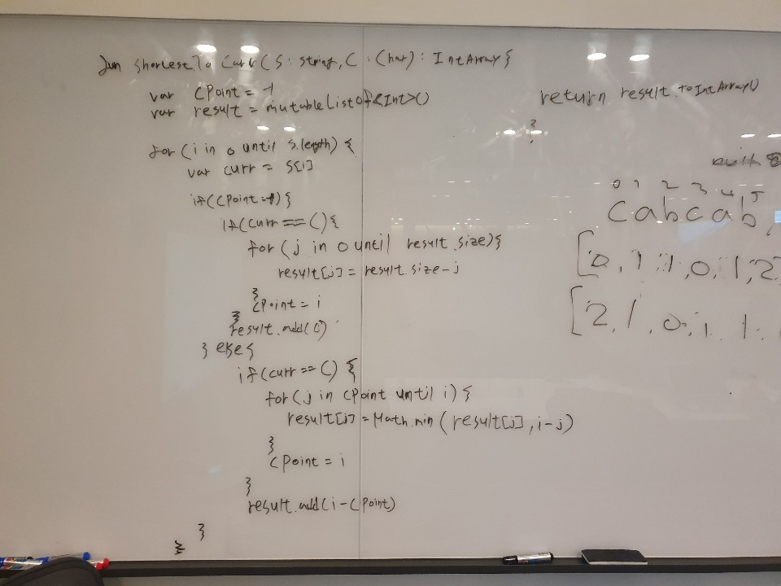
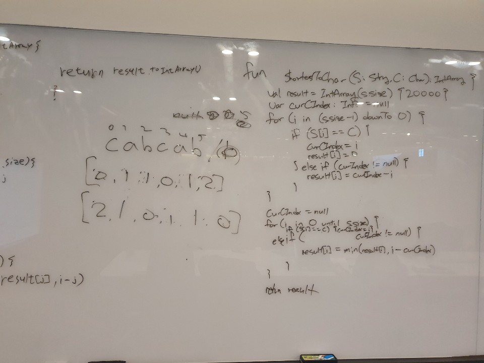
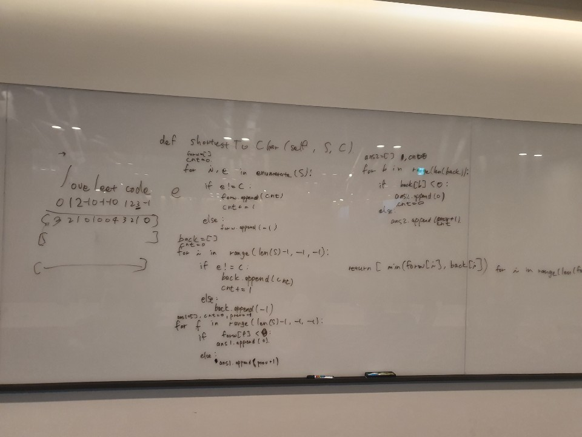
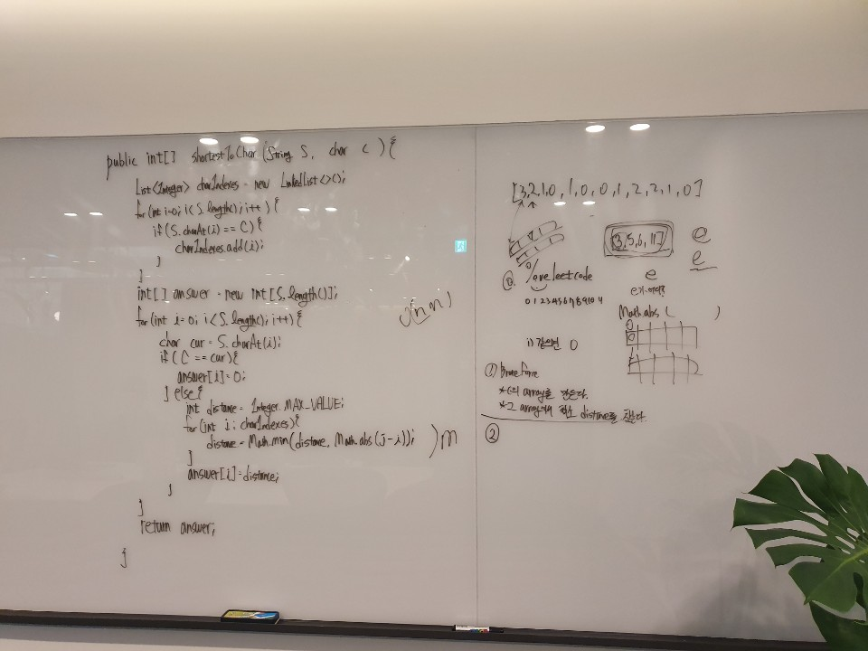
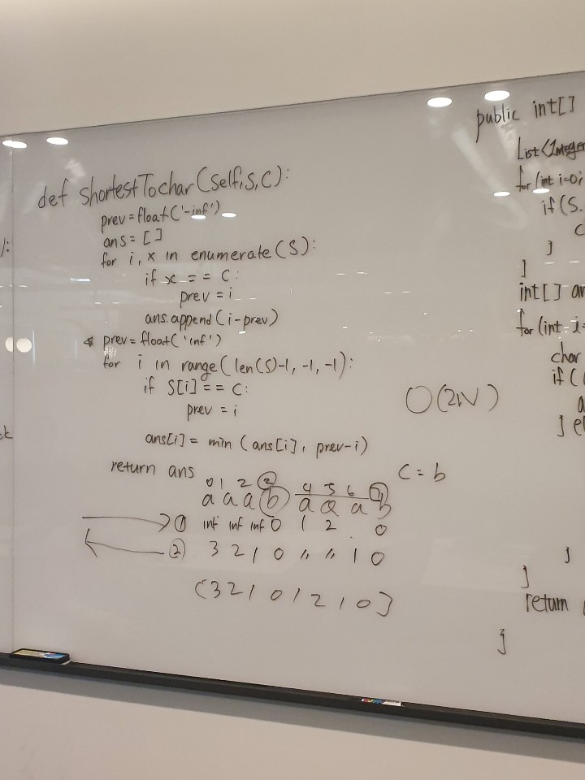

# 821. Shortest Distance to a Character

출제자: 테스

[Link](https://leetcode.com/problems/shortest-distance-to-a-character/)

- 출제 이유
  - 다양한 풀이가 나올 수 있는 문제를 내고 싶었다.

## Latte


## Kevin


- Time complexity: O(n)
- Space complexity: O(1)
- 음 양옆에 타깃이 어딨는지를 비교해서 더 작은 값을 알아야하니까 어떻게 해야 할까.. 고민하다 보니 그냥 왼쪽으로 한번, 오른쪽으로 한번씩 iterate하면서 더 작은 값을 넣으면 되겠다는 생각이 들었다.
- 처음엔 왼쪽 오른쪽 iteration한 값들을 따로 array에 저장한 후 최종적으로 더 작은 값으로 합쳐서 return해야할까 싶었는데 생각해보니 그냥 하나의 array에 값을 넣을 때 min 함수에 넣어서 하면 되겠구나 싶어서 따로 공간을 더 쓰지도 않게 되었다.
- 테쓰가 가져온 솔루션도 이와 같은 방식으로 하였다 하니 괜찮게 푼듯 ^.^

## stella


## Damian


- Time complexity: O(n^2) 
- Space complexity: O(n)
- 시간 안에 더 나은 방법을 생각해내지 못 해서 Brute Force에 가깝게 풀었다. 돌아가긴 하지만 좋은 점수를 얻긴 힘들 풀이이다. 자료구조를 거꾸로 순회한다는 생각을 잘 하지 못 하는 것 같다. 뭔가 틀에 갇혀있는 것 같은 느낌이다. 다양한 유형의 문제를 많이 풀어봐야겠다.
- 처음엔 Latte의 풀이처럼 인덱스를 세밀하게 다뤄 최적화하는 방법을 처음에 고민했는데 실패할 것 같아 풀이로 옮기지 못 했다. 이 부분은 많은 연습이 필요할 것 같다.
```java
// 수정된 풀이
public int[] shortestToChar(String S, char C) {        
    int[] answer = new int[S.length()];
    int currentCIndex = -1;
    
    for (int i = 0; i < S.length(); i++) {
        if (S.charAt(i) == C) {
            currentCIndex = i;
            answer[i] = 0;
        } else {
            if (currentCIndex != -1) {
                answer[i] = i - currentCIndex;
            } else {
                answer[i] = Integer.MAX_VALUE;
            }                
        }
    }
    
    currentCIndex = -1;
    for (int i = S.length() - 1; i >= 0; i--) {
        if (S.charAt(i) == C) {
            currentCIndex = i;        
        } else {
            if (currentCIndex != -1) {
                answer[i] = Math.min(answer[i], currentCIndex - i);
            }
        }
    }

    return answer;
}
```

## Tess



