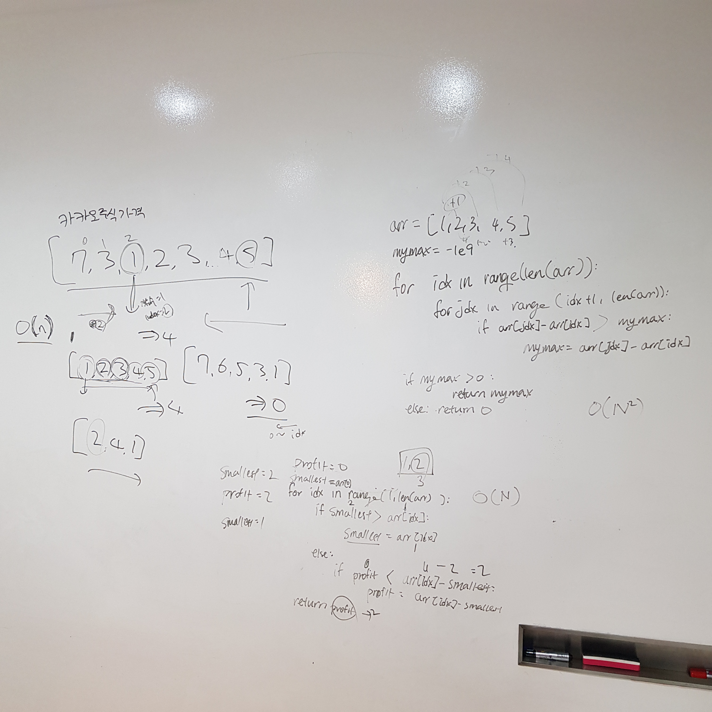

# 121. Best Time to Buy and Sell Stock

출제자: 케빈

[Link](https://leetcode.com/problems/best-time-to-buy-and-sell-stock/)

- 출제 이유
  - 첫 인터뷰인 만큼 너무 어렵진 않지만 최적화를 하려면 머리를 좀 굴려야 하는 문제로 뽑아봤다.

## Tess


---

## Kevin

- Brute Force로 풀면 간단하다. 그냥 모든 경우의 수를 돌아보는 것이다. 하지만 요러케 하면 O(n^2)
- 아래와 같이 최적화하면 O(n)까지 끌어올릴 수가 있다:

```kotlin
var curSmallestPrice = Integer.MAX_VALUE
var maxProfit = 0

for (price in prices) {
    maxProfit = max(maxProfit, price - curSmallestPrice)
    curSmallestPrice = min(curSmallestPrice, price)
}
```

- 즉, 한 번 루프 돌면서 현재 위치에서 그 이전까지의 값들 중 가장 작은 값만 기억해두고 있으면, 현재 값 - 가장 작은 값을 연산하면서 답을 구할 수 있다.
- 텟쓰가 O(n^2)으로 푼 것도 잘했지만, 무엇보다도 내가 힌트를 줬을 때 이해하고 한번에 코드로 옮기는걸 보고 깜짝 놀랐다. 나였으면 그 입장에서 한번에 적을 수 있었을까? 테쓰... 얼마나 빠르게 발전하는거냐구!!!
