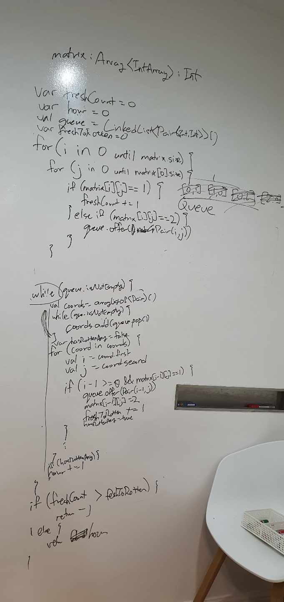

# 994. Rotting Oranges

출제자: 라떼

[문제 - Rotten Oranges ](https://leetcode.com/problems/rotting-oranges/)

- 출제 이유
  - 약간 어려운 문제로 골랐다. 엣지 케이스를 고려해야할 것이 좀 있는 친구로!

## Kevin


---

## Latte


```kotlin
fun orangesRotting(grid: Array<IntArray>): Int {
    var freshOranges = 0
    val rotQueue: Queue<Int> = ArrayDeque()
    val row = grid.size
    val column = grid[0].size
    var time = 0

    for (r in 0 until row) {
        for (c in 0 until column) {
            if (grid[r][c] == 2) {
                rotQueue.add(r * column + c)
            }
            if (grid[r][c] == 1) {
                freshOranges++
            }
        }
    }

    val dirs = arrayOf(intArrayOf(0,1),intArrayOf(0,-1),intArrayOf(1,0),intArrayOf(-1,0))
    while (freshOranges !=0 && rotQueue.isNotEmpty()) {
        for( i in 0 until rotQueue.size){
            val curr = rotQueue.poll()

            for(dir in dirs) {
                val r = curr / column + dir[0]
                val c = curr % column + dir[1]

                if(r in 0 until row && c in 0 until column && grid[r][c] == 1){
                    grid[r][c] = 2
                    rotQueue.add(r* column + c)
                    freshOranges--
                }
            }
        }

        time++
    }

    return if(freshOranges == 0) time else -1
}
```

문제를 보면 BFS형태로 풀어야겠다는 생각이 먼저 드는데, 케빈도 금방 queue를 활용해야겠다는 생각에 접근해서 놀랬다. 이 문제는 여러 가지 엣지케이스를 고려해야하는데
1. 시간 값을 잘 구할 수 있는지 (마지막에 +1하기 쉽다)
2. 안썩은 오렌지가 남았는지
3. 0,1,2가 각각 1개씩 들어왔을 때 잘 처리하는지.

케빈은 1번을 제외한 코드를 한 번에 짜서 생각보다 금방해결 할 수 있던 것같다. 특히 FreshOranges를 카운팅한다는 생각이 빠르게 들어서 놀랬다.

> 케빈이 프로그래밍하면서 누락한 1번 케이스에 대해서 조언할 때 쉽게 받아들이지 못하는걸 보고 나도 조심해야겠다고 느꼈다. 이제서야 지니가 이전에 한 말이 공감이 되었다!