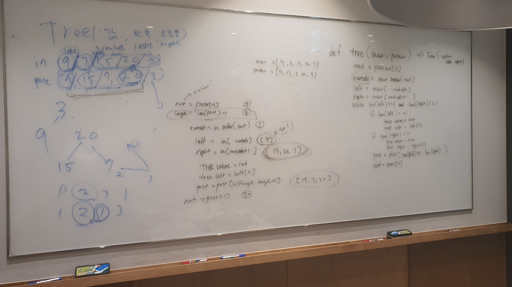

# 106. Construct Binary Tree from Inorder and Postorder Traversal

출제자: 라떼

[문제 - Construct Binary Tree from Inorder and Postorder Traversal ](https://leetcode.com/problems/construct-binary-tree-from-inorder-and-postorder-traversal/)

- 출제 이유
  - 트리 구조와 inorderTraversal과 postorderTraversal에 대한 이해도에 대한 문제로 까다로운 문제와 복잡한 로직을 놓침없이 구현해 내야해서 난이도가 어려운 문제가 된다.

## Tess



## Latte


```kotlin
//solution ver1 with lists

class Solution {
    fun buildTree(inorder: IntArray, postorder: IntArray): TreeNode? {
        return recurs(postorder.reversedArray().toList(), inorder.toList())
    }

    fun recurs(revPost: List<Int>, inorder: List<Int>): TreeNode? {
        if (inorder.isEmpty()) return null

        val root = TreeNode(revPost[0])
        val rootIndex = inorder.indexOf(revPost[0])

        root.left = recurs(
            revPost.slice(revPost.size - rootIndex until revPost.size)
            , inorder.slice(0 until rootIndex)
        )
        root.right = recurs(
            revPost.slice(1 until revPost.size - rootIndex)
            , inorder.slice(rootIndex + 1 until inorder.size)
        )
        return root
    }
}

```

---


```kotlin
//solution ver2 with indexes

class Solution {
    fun buildTree(inorder: IntArray, postorder: IntArray): TreeNode? {
        inorder.mapIndexed{ index, value -> inMap[value] = index}
        return recursive(postorder.reversedArray(), inorder, 0, 0, inorder.size - 1)
    }

    fun recursive(revPost: IntArray,
                  inorder: IntArray,
                  postIndex: Int,
                  inStart: Int,
                  inEnd:Int): TreeNode? {

        if (inStart > inEnd) return null
        val root = TreeNode(revPost[postIndex])
        val rootIndex = inMap[root.`val`]!!
        // Note this is where ordering is flipped from the previous problem
        root.right = recursive(revPost, inorder, postIndex + 1, rootIndex + 1, inEnd)
        root.left = recursive(revPost, inorder, postIndex + inEnd - rootIndex + 1, inStart, rootIndex - 1)
        return root
    }
}
```

이 문제를 풀 땐 우선 inorder / postorder에 대한 리스트를보고 룰을 찾아내는 것이 가장 선결과제이다. 이런 유형은 처음풀어보는데 추후에 비슷한 문제에 도움이 될 것같다.

다음은 리스트를 활용해서 문제를 풀어가는 방법에 대한 가이드이다.

1.  inorder 방식으로 정렬된 리스트에는 왼쪽 노드리스트 / 루트 / 오른쪽 노드리스트 형식으로 도입된다.
2. postorder 방식으로 정렬된 리스트는 왼쪽 노드리스트 / 오른쪽 노드 리스트 / 루트 형식으로 도입된다.
3. 주어진 리스트들에서 postorder에서 마지막값으로 루트를 삼고, 그 값이 inorder에서 어디에 있는지 인덱스를 찾는다.
4. inorder에서 루트 왼쪽을 leftInorder로 짜르고 루트 오른쪽을 rightInorder로 짜른다.
5. post와 in은 사이즈가 같으므로 같은 사이즈 만큼 left를 짜른다. 나머지를 right로 짜른다.
6. 재귀를 통해 3번부터의 행위를 반복한다.
7. 결과를 반환한다.

밑에 최적화된 코드는 index를 활용해서 위의 로직을 재해석하도록 된 문제다.

실제로 면접에서 처음 맞이했으면 문제 풀기 쉽지 않았을 것같았고, 테쓰가 고생을 많이했다. 인터뷰이가 모르는 문제를 맞닥드렸을 때 조금 더 적극적으로 인터뷰어에게 질문을 하면 좋을 것같다. 

음.. 문제를 실제로 못풀더라도 커뮤니케이션능력이나 적극성을 어필할 순 있을 것같다. **면접관을 같이 협업하는 시니어 동료라고 가정하고** 도움을 구하면서 문제를 해결해나가는 스탠스가 가장 좋은 것같다.


> 앉아서 문제 풀 때보다 어려워진다는 점을 인지 못하고 어려운 문제를 그대로 가져왔다. 이 또한 좋은 경험이라면 좋은 경험인데, 지금 시기엔 어려웠던 것같다. 테쓰 미안해오 ㅠㅠ