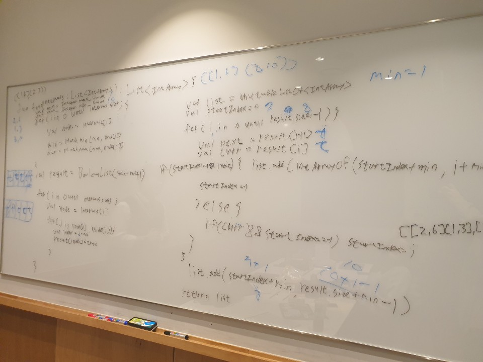

# 56. Merge Intervals

출제자: 스텔라

[문제 - Merge Intervals ](https://leetcode.com/problems/merge-intervals/)

- 출제 이유
  - medium 으로 난이도를 올린 첫 시간이라서 accept rate 가 높은 문제를 선정했다.
  - edge case가 여러개 나올 수 있는 문제여서 이에 대응하는 법을 연습할 수 있다.
  - 다양한 풀이법이 나올 수 있는 문제라서 여러 방법을 고민해볼 수 있다.

## Latte


- 음 처음에 문제를 접근할  때, 처음에 떠오르는 방법으로 앞값을 기준으로 정렬하고 뒷값만 비교해가면서 하면 될것같다고 생각했는데, 이게 소트를 하는 것에 대한 거부감이 좀 있었던 것같다. nlogn으로 해결하는게 좋지 않은 방법같았고, n으로 가능할 것같았는데, 풀고나니 훨씬 크리티컬한 부분이 생겼다. 

- 결국엔 boolean어레이 형태로 문제를 풀었고, 추후에 개선한 방법으로 map에 true / false를 카운팅해서 해결하는 방법으로 했었다.
- 아래는 맨처음 생각한대로 코드를 개선한 코드이다.

```kotlin

class Solution {
    fun merge(intervals: Array<IntArray>): Array<IntArray> {
        if (intervals.size in 0..1) return intervals
        
         intervals.sortBy { ints -> ints[0] }

        val result = mutableListOf<IntArray>()
        var array = mutableListOf<Int>()
        var maximumIndex = 0

        for (i in 0 until intervals.size) {
            val current = intervals[i]
            if (array.isEmpty()) {
                array.add(current[0])
            } else {
                if (current[0] > maximumIndex) {
                    array.add(maximumIndex)
                    result.add(array.toIntArray())
                    array = mutableListOf()
                    array.add(current[0])
                }
            }

            maximumIndex = Math.max(maximumIndex,current[1])

            if(i == intervals.size-1){
                array.add(maximumIndex)
                result.add(array.toIntArray())
            }
        }
        return result.toTypedArray()
    }
}

```

> 다음엔 그냥 맨처음에 드는 생각으로 말해야겠다.. 고민을 덜 하고 인터뷰어가 이끄는데로 진행해야겠다.

---

## Kevin

- 처음에 라떼의 접근 방식을 보고 오! 아주 creative한 방법인거같다! 싶었는데 진행되는걸 보면서 그냥 소팅하고 기존대로 하는게 나았겠다.. 라는 생각이 들었다 ㅋㅋㅋㅋㅋㅋ
- 그 외에도 흠.. 뒤에서 지켜보면서 **나는 앞으로 어떻게 풀어가야 할지**에 대한 여러가지 생각이 들었는데 아직 생각이 정돈되진 않았기에 다음에 공유 💁‍♂️.
- 풀어보기 재밌는 문제라고 생각한다.

---

## Stella
### 예시 답변 1
```python
class Solution:
    def merge(self, intervals):
        intervals.sort(key=lambda x: x.start)
        merged = []
        for interval in intervals:
            # if the list of merged intervals is empty or if the current
            # interval does not overlap with the previous, simply append it.
            if not merged or merged[-1].end < interval.start:
                merged.append(interval)
            else:
            # otherwise, there is overlap, so we merge the current and previous
            # intervals.
                merged[-1].end = max(merged[-1].end, interval.end)
        return merged
```
* intervals 를 첫번째 element 기준으로 sorting 을 한 후 풀이를 시작하면 간단해진다.
* intervals 의 elelemt 들을 하나씩 돌면서 merged list 이 비어있거나, overlap 이 없다면 현재 interval 을 merged 에 append 한다.
* overlap 이 있다면 마지막 merged 의 마지막 element 에 두번째 값을 현재 interval 의 두번째 값으로 치환해준다.

### 예시 답변 2
```python
class Solution(object):
    def merge(self, intervals):
        if len(intervals)<=1:
            return intervals
        s_inte=sorted(intervals, key=lambda e: e[0])
        
        ans=[s_inte[0]]
        flag=1
        
        for i in range(1, len(s_inte)):
            if flag==0:
                first=s_inte[i-1]
            else:
                first=ans[-1]
            second=s_inte[i]

            if second[0] <= first[1]:# overlap
                flag=1
                ans.pop()
                ans+=[[first[0], max(first[1], second[1])]]
            else:
                flag=0
                ans+=[second]
        return ans
```
* 예시답변 1과 같은 컨셉이지만 조금 더 직관적이면서도 덜 정돈된 풀이이다.
* 이전항에 overlap 이 있었다면(flag 로 표시) 그 다음항에서 비교할 대상을 ans(답변)의 마지막 값이 되도록 지정한다.

### 예시 답변 3
```python
class Solution(object):
    def merge(self, intervals):
        """
        :type intervals: List[List[int]]
        :rtype: List[List[int]]
        """
        n=len(intervals)
        starts=[0]*n
        ends=[0]*n
        for i in range(n):
            starts[i]=intervals[i][0]
            ends[i]=intervals[i][1]
        starts.sort()
        ends.sort()

        res=[]
        j=0 # start of interval
        for i in range(n):
            if i==n-1 or starts[i+1]>ends[i]:
                res.append([starts[j], ends[i]])
                j=i+1
        
        return res
```
* 각 interval 들의 첫번째 항 list(starts)과 두번째 항 list(ends)를 각각 만들고 정렬한다.
* starts 와 ends 를 순차적으로 돌면서 interval 이 이뤄질 수 있는 경우를 확인하여 res 에 append 한다.
* 라떼가 풀이시간에 이와 유사한 아이디어를 냈었다.
