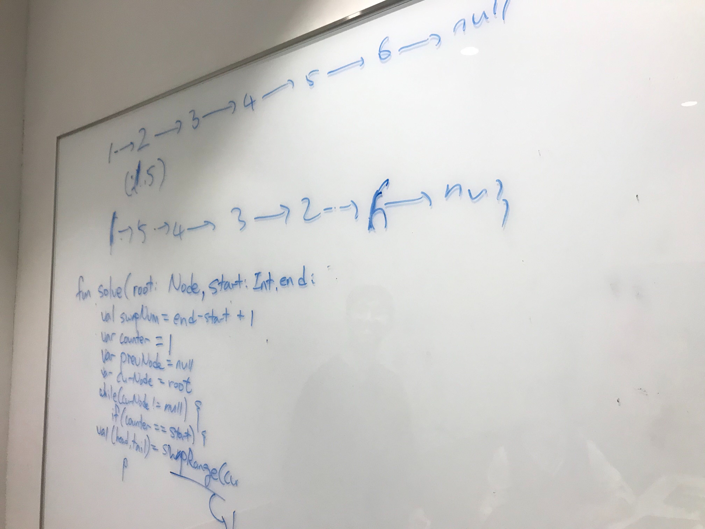

# 92. Reverse Linked List II

출제자: Damian

- 출제 이유
  - 코딩 인터뷰를 통해 보고자 하는 것은 크게 두 가지라고 생각한다. 하나는 구현 능력을 포함한 문제 풀이 능력을 보는 것이고 다른 하나는 자료구조 및 알고리즘에 대한 이해를 보는 것이다. 후자에 조금 더 무게를 실어보고 싶어 이 문제와 함께 링크드 리스트에 대한 이해를 볼 수 있는 질문들을 준비했다.
- 질문 및 예시 답변
  - (5분) Linked List에 대한 기본적인 질문들
    - Q) Linked List의 종류를 어떻게 구분할 수 있을지? 
      - A) Singly Linked List, Circular Linked List, Doubly Linked List, Circular Doubly Linked List
    - Q) Singly Linked List와 Doubly Linked List는 어떤 차이가 있을지? Doubly Linked List를 중심으로 설명
      - A) 한 번에 앞으로 / 뒤로 탐색 가능
      - A) 특정 index의 데이터를 가져와야 할 때 가운데를 기준으로 앞에서 더 가까우면 앞에서부터 탐색할 수 있고 뒤에서 더 가까우면 뒤에서 부터 탐색할 수 있기 때문에 탐색에 더 유리하다.
      - A) 이전 노드를 기억해야 하기 때문에 더 많은 저장 공간을 사용해야 한다.
    - Q) Doubly Linked List에서 노드를 추가하는 상황을 말로 표현해볼 수 있을지?
    - Q) Singly Linked List 기준 주요 연산의 시간 복잡도는?
      - A) Create: O(1)
      - A) Insert: O(n)
      - A) Search: O(n)
      - A) Traverse: O(n)
      - A) Delete a node: O(n)
    - Q) Java에서 ArrayList와 LinkedList의 차이는? 각각의 내부 구현 특징은?
      - A) [ArrayList Details](https://knpcode.com/java/collections/arraylist-internal-implementation-in-java/)
      - A) [LinkedList Details](https://knpcode.com/java/collections/linkedlist-internal-implementation-in-java/)
  - (10분) Singly Linked List를 reverse 하는 법을 말과 그림을 통해 설명할 수 있을지?
    - [문제 - Reverse Linked List](https://leetcode.com/problems/reverse-linked-list/)  
    - 반복문, 재귀 두 방법으로 문제를 풀 수 있는지?
    - 각각의 시간 복잡도, 공간 복잡도는?
  - (25분) Singly Linked List에서 특정 부분만 reverse 할 수 있을지?
    - [문제 - Reverse Linked List II](https://leetcode.com/problems/reverse-linked-list-ii/)  


## Kevin


- Ha. 일단 못풀어서 아쉽다.. 다음에는 꼭..!!!!
- **데미안의 진행 방식 아주 좋다고 생각한다**. 나도 다음에 문제낼 때 저렇게 준비해갈까 싶다.
- 데미안의 질문들에 많은 부분 답하긴 했으나, 특히 Singly Linked List를 재귀로 풀 수 있는 방법에 대해서는 정말 머리가 안돌아갔다. 지금 풀라고 해도 크게 자신이 없기에 **데미안이 올려준 문제를 풀어봐야겠다**.
- 그리고 오늘의 메인 문제.. 어떻게 풀어볼지 생각은 들었으나 코드로 옮기지를 못했다. 근데 평소에 LinkedList로 막 포인터 옮기고 이런걸 되게 헷갈려했는데 오늘 그 진가가 드러난 듯 하다 ㅋㅋㅋㅋㅋㅋㅋ. 연습해야지!!!!!
- 우선 아래는 다시 풀어본 코드!

```kotlin
fun reverseBetween(head: ListNode?, m: Int, n: Int): ListNode? {
    if (head?.next == null || m == n) {
        return head
    }

    val leftBuffer = ListNode(-1).apply { next = head }
    var curNode: ListNode? = leftBuffer
    val swapCount = n - m + 1
    for (i in 0 until m - 1) {
        curNode = curNode?.next
    }
    curNode?.next = reverseRange(curNode?.next, swapCount)
    return leftBuffer.next
}

private fun reverseRange(node: ListNode?, count: Int): ListNode? {
    var cur = node
    var prev: ListNode? = null
    var next: ListNode? = null
    for (i in 0 until count) {
        next = cur?.next
        cur?.next = prev
        prev = cur
        cur = next
    }

    node?.next = next
    return prev
}
```

- 데미안이 올려준 방식과 동일하다(다만 코틀린에 저 계속 뒤에 물음표 붙이는걸 떼어내고 싶은데 오늘은 일단 여기까지...)
- **연습하잣!!**

---

## Damian
- 예시 답변
```java
/**
 * Definition for singly-linked list.
 * public class ListNode {
 *     int val;
 *     ListNode next;
 *     ListNode(int x) { val = x; }
 * }
 */
class Solution {
    public ListNode reverseBetween(ListNode head, int m, int n) {
        if (head == null || head.next == null || m == n) {
            return head;
        }
        ListNode dummy = new ListNode(-1);
        dummy.next = head;
        ListNode prev = dummy;
        for (int i = 0; i < m - 1; i ++) {
            prev = prev.next;
        }
        // prev의 next를 n번 노드로 한다.
        prev.next = doReverseBetween(prev.next, m, n);
        return dummy.next;
    }
    
    // 함수는 reverse 한 뒤 head를 반환한다. 결과적으로 n번 노드를 반환하는 것이다.
    private ListNode doReverseBetween(ListNode head, int m, int n) {
        if (head == null || head.next == null || m == n) {
            return head;
        }
        ListNode prev = null;
        ListNode curr = head;
        ListNode next = null;
        for (int i = 0; i < n - m + 1; i++) {
            next = curr.next;
            curr.next = prev;
            prev = curr;
            curr = next;
        }
        // m번 노드의 next를 n번 노드의 next로 한다.
        head.next = next;
        return prev;
    }   
}
```
- 풀이의 컨셉은 다음과 같다. m번 노드부터 n번 노드까지의 reverse는 일반 Linked List의 reverse와 유사하게 한다. 다른 점은 reverse를 한 후 원래 n번째에 있던 노드를 prev.next에 연결해준다는 점과 m번째 노드의 next를 n번째 노드의 next로 연결해 준다는 것이다.
- LeetCode의 솔루션에 보면 이것과 다른 방식으로 문제를 풀었다 두 개의 포인터를 이용해 문제를 푸는 것이다. 내 생각엔 별로 직관적이지 않았다. 이해를 하면 재밌긴 하겠지만 굳이? 라는 생각이 들었다. 
