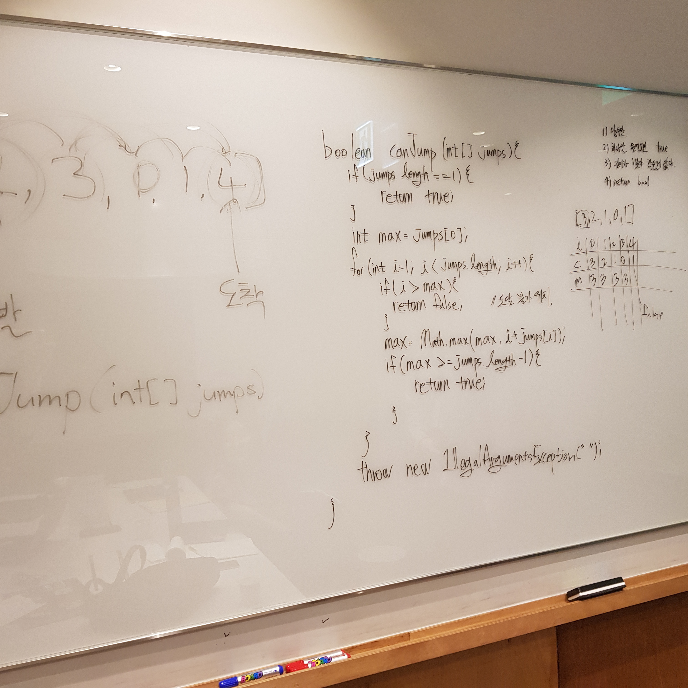

# 55. Jump Game

출제자: Kevin

[Jump Game](https://leetcode.com/problems/jump-game/)

- 출제 이유
  - Dynamic Programming을 소개할 때 자주 보이는 예시로써, DP 입문 문제로 가져왔다(뜻대로 안되었지만).
  - 최적화 방식이 다양하고 흥미롭다(뜻대로 안되었지만).

---

## Damian


---

## Kevin

- 먼저.. 나 스스로 풀 때도 DP로 접근하고 그 후에 퍼포먼스를 개선해나가는 방식으로 했고, Solution에 보이는 예시들도 모두 DP로 풀어서 그런 마음가짐으로 출제를 준비했는데, 완전 다른(그리고 오히려 더 쉬운) 방식으로 풀어서 당황했다.
- 이렇게 쉽게 풀리는게 맞나? 싶어서 계속 의심했지만 결국 맞는 거였다. 이런 풀이가 있었나? 싶어서 Solution이 아닌 Discuss탭을 봤더니 있더라... ~~보니까 라떼도 그렇게 풀었었더라~~
- **다음엔 더 꼼꼼하게 준비해 가야겠다** ㅎ.ㅎ(미안 데미안!!)
- 암튼, 내가 준비했던건 여러가지 있는데 최종적으로 기대했던 형식은 뒤에서부터 앞으로 순회하면서 메모해가며 풀어가는 방식이다. 즉, 맨 오른쪽(골인 지점)을 true로 마킹해두고, 왼쪽으로 하나씩 순회하면서 true인 부분에 도달할 수 있는지 순서대로 마킹해가는 방식이다.

```kotlin
val memo = hashMapOf<Int, Boolean>()
memo[nums.size - 1] = true

for (i in (nums.size - 2) downTo 0) {
    if (i + nums[i] >= nums.size - 1) {
        memo[i] = true
    } else {
        for (j in (i + 1)..(i + nums[i])) {
            if (memo[j] == true) {
                memo[i] = true
                break
            }
        }
    }
}

return memo[0] == true
```

- 여기서 더 최적화할 수 있는 방법이 있는데, 그건 생략하도록 하고, **데미안이 접근한 방식이 이해하기도 더 쉽고 깔끔하다**. 훌륭!
