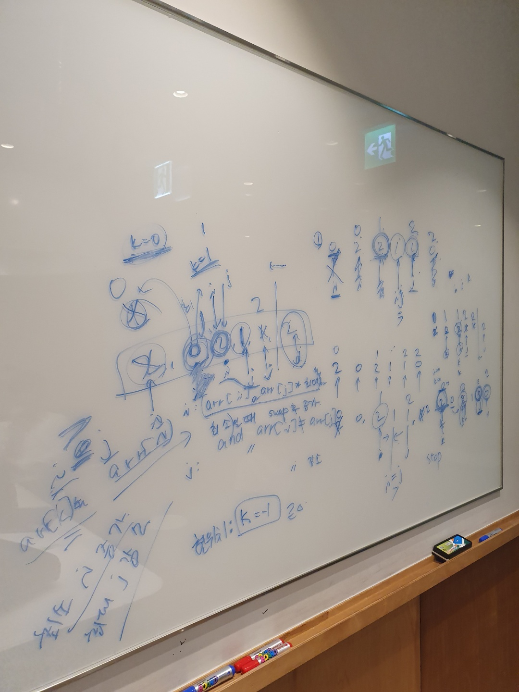
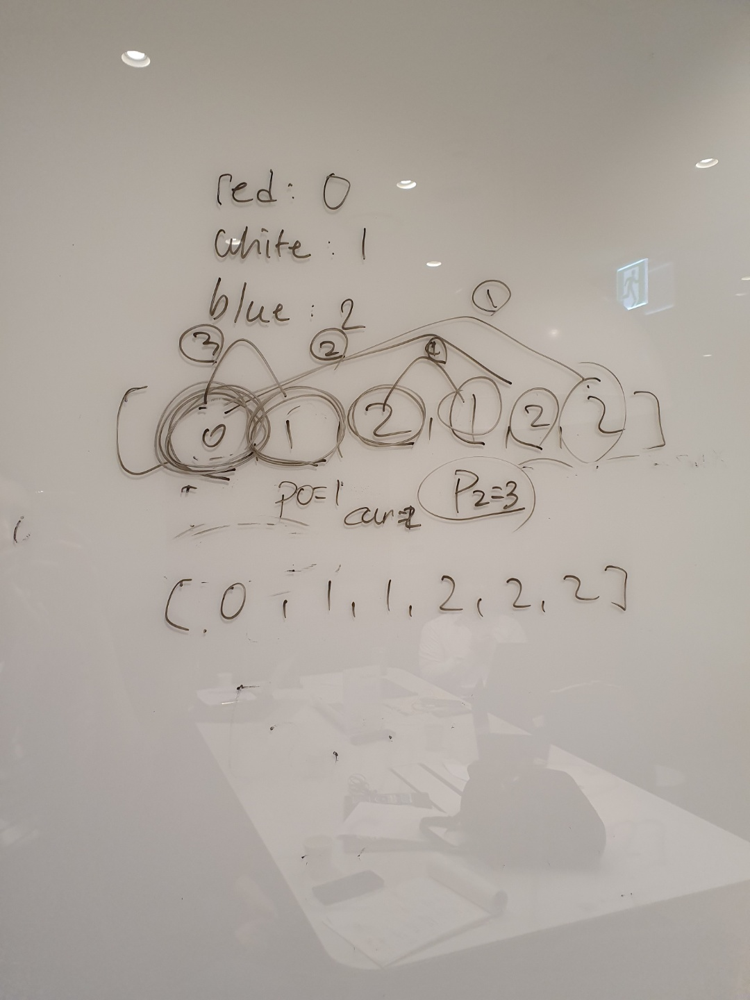
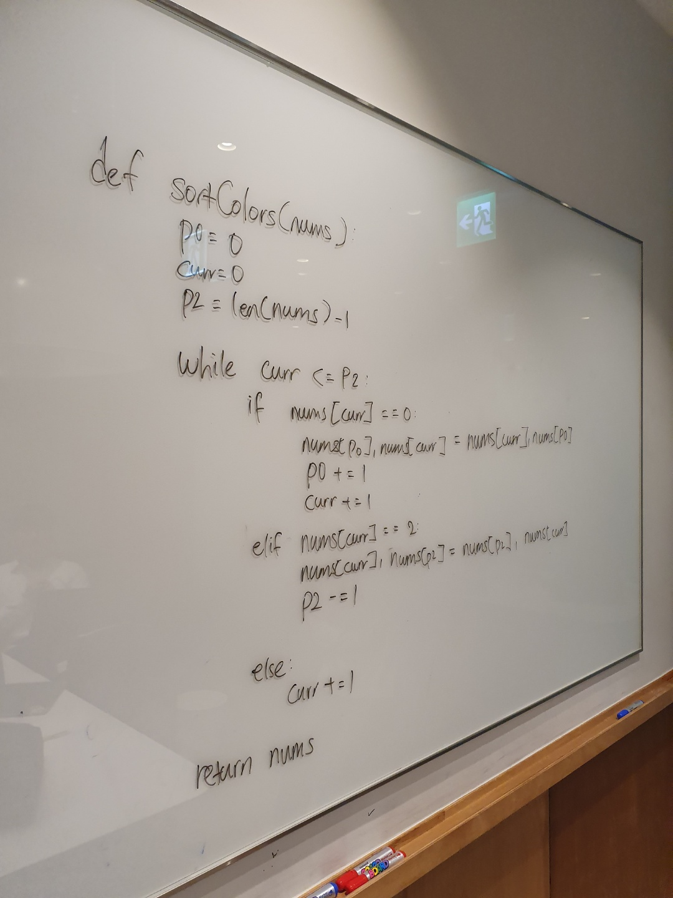

# 75. Sort Colors

출제자: Tess

[Sort Colors](https://leetcode.com/problems/sort-colors/)

- 출제 이유
  - 문제를 풀었을때, 조건 주는 연습하기 좋은 문제라고 생각되어서 출제하게 되었다!
  - 이런 형식의 문제를 면대면으로 풀게되면 긴장되어서 시간이 많이 걸릴 것 같다 ㅠㅠ

---

## Stella

---

## Tess

- 문제를 고르면서 저번에 데이안이 했던 것처럼 팔로업 질문을 준비해가려고 했는데,
- 문제가 문제이다보니 딱히 알고리즘을 물어볼게 없었다!
- 이런 유형의 문제는 많이 접해보는게 최선인 것 같기도 하구..!
- counting sort를 대놓고 쓰지 말라고 적혀있어서..ㅎㅎ
- 최적의 솔루션이 진짜로 더 빠른게 맞나? 라는 이야기가 있었는데, 그 부분에 대해서도 생각해봐야겠다.
