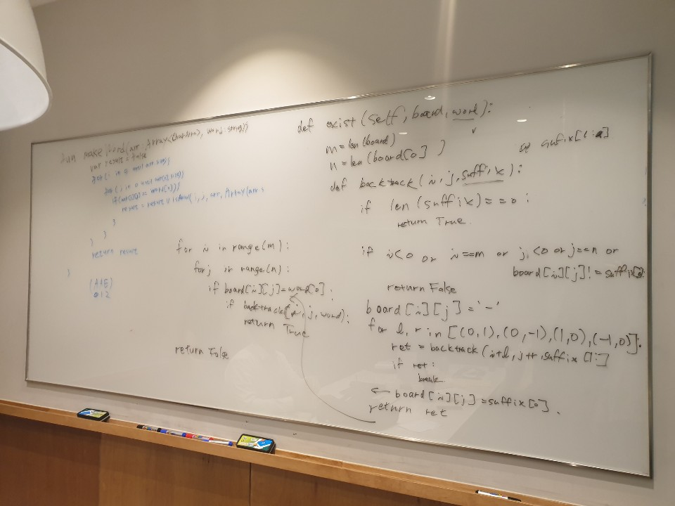

# 79. Word Search

출제자: Stella

[Word Search](https://leetcode.com/problems/word-search/)

- 출제 이유
  - backtracking 문제의 대표적인 예시가 되어줄 것 같았다.
  - backtracking 을 하면서 time complexity, space complexity 를 생각해본적은 잘 없는 것 같아서 함께 공유하면 좋을 것 같았다.
---

## Latte


---

## Stella

```python
class Solution(object):
    def exist(self, board, word):
        """
        :type board: List[List[str]]
        :type word: str
        :rtype: bool
        """
        m=len(board)
        n=len(board[0])
        
        def backtrack(i, j, suffix):
            if len(suffix)==0:
                return True
            if i <0 or i == m or j <0 or j == n or board[i][j]!=suffix[0]:
                return False
            ret=False
            board[i][j]='-'
            for l, r in [(0, 1), (0, -1), (1, 0), (-1, 0)]:
                ret=backtrack(i+l, j+r, suffix[1:])
                if ret:
                    break
            board[i][j]=suffix[0]
            return ret
            
        for i in range(m):
            for j in range(n):
                if board[i][j]==word[0]:
                    if backtrack(i, j, word):
                        return True
        return False
```
- 위 문제의 time complexity 는 각 cell 에서 상하좌우로 4번씩 연산이 필요해지기때문에 (한번에 4개씩 가지를 뻗는 트리의 leaf node 수라고 생각하면되므로) O(N⋅4^L)가 된다. (N : cell 의 갯수 / L : word 의 길이)
- space complexity 는 한번에 recursion step 에서 상수개의 space 를 쓰게되고, 이 recursion 이 word length 만큼의 횟수로 진행되기때문에 space complexity 는 O(L) 이 된다.
- 엣지케이스를 몇개 준비해갔는데 라떼는 절대 내 예상대로 풀지 않기때문에 매번 별 소용이 없다.
