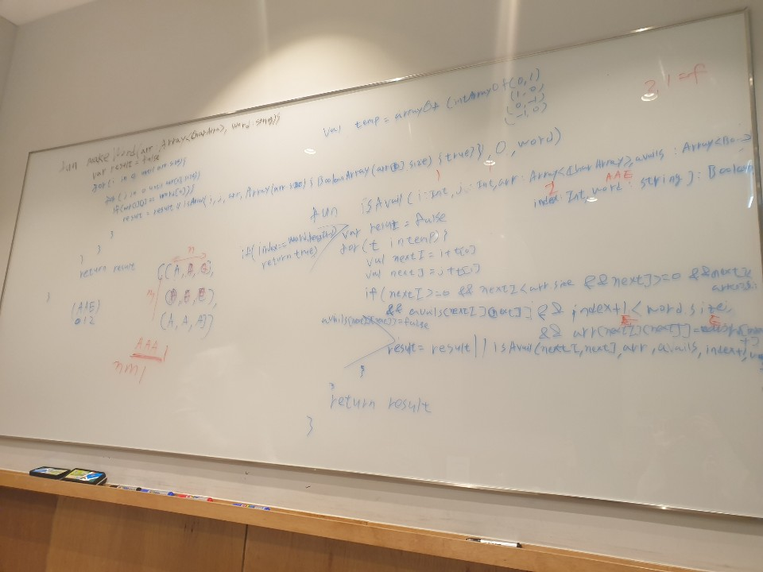

# 79. Word Search

출제자: Kevin

[Word Search](https://leetcode.com/problems/word-search/)

- 출제 이유
  - backtracking 문제의 대표적인 예시가 되어줄 것 같았다.
  - backtracking 을 하면서 time complexity, space complexity 를 생각해본적은 잘 없는 것 같아서 함께 공유하면 좋을 것 같았다.
---

## Latte

---
