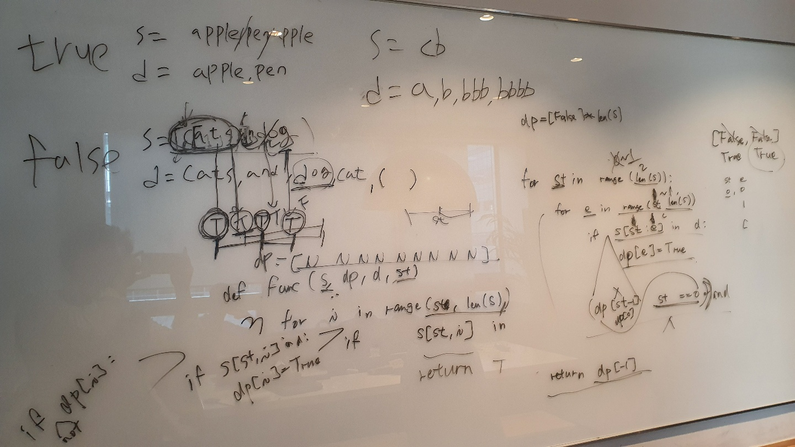

# 139. Word Break

출제자: latte

[Word Break](https://leetcode.com/problems/word-break/)

- 출제 이유
  - dp형태의 문제를 자주 접근하려고 출제했고, 기본적인 DP형태에서 약간 다른 유형이기 때문에 학습해두면 비슷한 유형을 쉽게 접근할 수 있을 것같아서 선정했다.

---

## Stella


---

## Latte

```kotlin
//with Queue

fun wordBreak(s: String, wordDict: List<String>): Boolean {
    val wordDictSet = HashSet(wordDict)
    val queue = LinkedList<Int>()
    val visited = IntArray(s.length)
    queue.add(0)

    while (!queue.isEmpty()) {
        val start = queue.remove()
        if (visited[start] == 0) {
            for (end in start + 1..s.length) {
                if (wordDictSet.contains(s.substring(start, end))) {
                    queue.add(end)
                    if (end == s.length) {
                        return true
                    }
                }
            }
            visited[start] = 1
        }
    }
    return false
}
```

```kotlin
// standard DP

fun wordBreak(s: String, wordDict: List<String>): Boolean {
    val marking = Array(s.length + 1) { it == 0 }

    for (i in 0..s.length) {
        for (j in 0 until i) {
            if (marking[j] && wordDict.contains(s.substring(j until i))) {
                marking[i] = true
                break
            }
        }
    }
    return marking[s.length]
}


```

- DP형태로 문제로 보편적으로 솔브하는 형태인 List<Boolean>을 가지고 체크해도 되지만 (2번째 솔루션) queue를 활용하면 조금 더 연산 속도를 줄일 수 있다.
-  Queue를 사용하면 연산의 횟수를 조금 더 줄일 수 있기 때문에 조금 더 최적의 솔루션으로 볼 수 있다.

> 생각보다 문제의 난이도를 조금 낮출 필요가 있을 것같다. 저번주에도 느꼈지만 현장에서 푸는 것과 앉아서 푸는 것의 차이는 크고, 덕분에 예상보다 더 많은 가이드를 줬었어야했다.

> 또 스텔라가 맨처음에 제시했던 솔루션의 형태에서 조금 더 가공하면 n제곱으로 해결할 수 있는 솔루션이 있었는데, 현장에서 해당 솔루션이 생각이 안나서 반복문으로 유도했는데, 요건 조금 내가 준비가 부족했던 것같다.