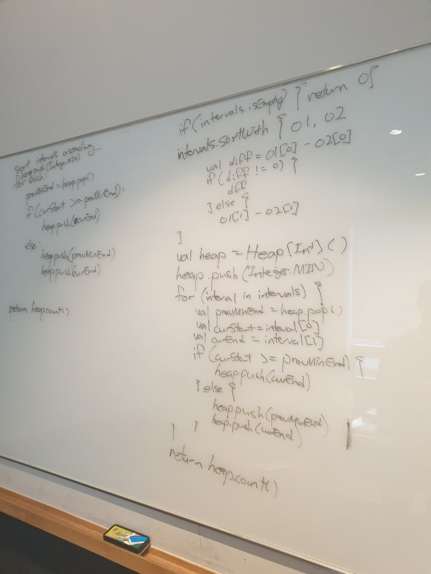

# Meeting Rooms II

출제자: Stella

[Meeting Rooms II](https://leetcode.com/problems/meeting-rooms-ii/)

- 출제 이유
  - heap 을 연습해볼 수 있으면서, heap 외의 다른 풀이로 푸는것도 가능한 좋은 문제라고 생각했다.

---

## Kevin


- 사실 지난주에 데미안이 푸는 모습에 감명을 받아, 나도 순서대로 접근해가는 연습을 해야겠다고 생각하여 혼자 연습하다가 이번에 처음으로 데미안식으로 해봤다. 요지는 **실제 코드 작성은 인터뷰어의 허락을 받기 전까진 하지 않는것!** 그리고 **계속 인터뷰어의 생각을 묻는 것!**
- Map을 사용해서 푸는 것이 O(n^2)가 된다는 것 까지는 생각할 수 있었지만, 스텔라가 **O(1)으로 최소값에 접근할 수 있는 자료구조**라는 힌트를 줬을 때 아무것도 떠오르지 않았다 ㅋㅋㅋㅋ. Heap..을 안써본지 너무 오래 되었기 때문에..
- 하지만 스텔라가 Heap이라는 키워드를 던져주니까 다시 기억이 나서 풀어나갈 수 있었다. 음, 근데 긍정적으로 보면 애초에 이런게 자연스러운 인터뷰의 모습 아닐까? 스택오버플로우에 검색을 못하니까 인터뷰어한테 검색을 하는거지.

```kotlin
// Loading...
```

- 그 후에 스텔라가 Heap을 안쓰고 풀 수 있는 방법도 공개해줬는데, 이해는 되는데 저게 왜 될 수 있는건지는 아직 모르겠다. 근데 문제들을 풀다보면 그런 풀이들이 여럿 있다. **코드는 이해가는데, 저렇게하면 정말 구멍이 없는건지 의심이 가는?** ㅋㅋㅋㅋ

---

## Stella
### solution 1.
- heap 을 이용해서 푸는 방법은 아래와 같다. 
- 미리 interval 들을 start time으로 정렬해둔다. 이 interval을 하나씩 순회하면서, 이전에 방문했던 interval의 end값중 최소값이 현재의 interval의 start 값보다 작은지를 확인하여 overlab발생여부를 확인한다. 그리고 이때마다 필요한 meeting room의 갯수를 하나씩 증가시켜주면 된다. 
- kevin이 time complexity O(n^2)의 풀이를 손쉽게 떠올렸고, 거기에 heap에 대한 힌트만으로 바로 최적화를 시킨다는 점이 놀라웠다.
```python
class Solution:
    def minMeetingRooms(self, intervals: List[List[int]]) -> int:
        if not intervals:
            return 0

        free_rooms = []
        intervals.sort(key= lambda x: x[0])

        heapq.heappush(free_rooms, intervals[0][1])

        for i in intervals[1:]:
            if free_rooms[0] <= i[0]:
                heapq.heappop(free_rooms)
            heapq.heappush(free_rooms, i[1])
        return len(free_rooms)
```
### solution 2.
- heap 없이, start time과 end time을 따로 관리하는 방식으로 이 문제를 풀 수도 있다.
```python
class Solution:
    def minMeetingRooms(self, intervals: List[List[int]]) -> int:
        if not intervals:
            return 0
        used_rooms = 0
        start_timings = sorted([i[0] for i in intervals])
        end_timings = sorted(i[1] for i in intervals)
        L = len(intervals)

        end_pointer = 0
        start_pointer = 0

        while start_pointer < L:
            if start_timings[start_pointer] >= end_timings[end_pointer]:
                used_rooms -= 1
                end_pointer += 1
            used_rooms += 1    
            start_pointer += 1   
        return used_rooms
```
