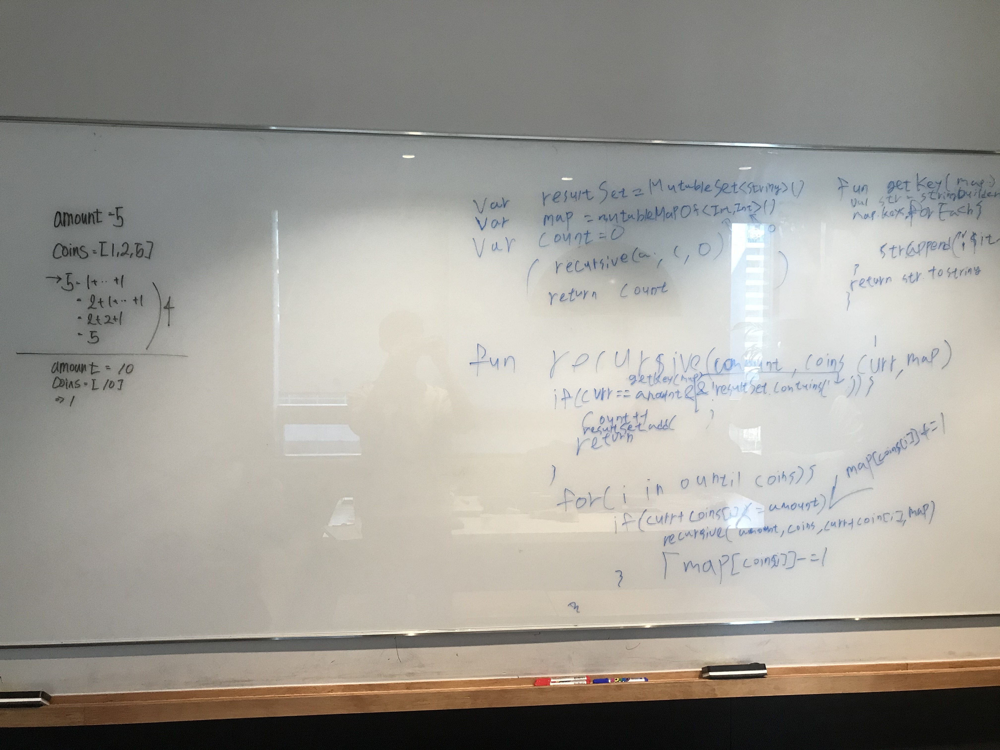

# 518. Coin Change 2

출제자: Damian

[Coin Change 2](https://leetcode.com/problems/coin-change-2/)

- 출제 이유
  - DP 문제의 고전이라고 전해들었다. DP에 취약해서...DP와 관련된 유명한 문제들 위주로 공부하고 있었고 풀어보던 중 상당히 마음에 들어서 출제했다. 

---

## Latte


- 처음에 문제에 접근할 때 recursive로 각각 함수 호출 시 마다 모든 coin을 한번씩 계산해보고 하는 로직으로 접근했는데, 해당 패턴에 대해서 유효한지 체크하는 로직에 대해서 처리하기가 까다로웠다. 
-  그리고 해당 코드로 리트코드를 제출해봤을 때, 타임아웃이 났다.
-  데미안이 제시해준 솔루션으로 아래와 같이 문제를 해결 할 수 있었다.

```kotlin
fun change(amount: Int, coins: IntArray): Int {
    val dp = IntArray(amount + 1) { if (it == 0) 1 else 0 }

    for (c in coins) 
        for (i in c until dp.size) 
            if (i -c >= 0) 
                dp[i] += dp[i - c]
    
    return dp[amount]
}
```

>P.S 다시풀 때 처음에 문제에 접근한 로직이 다음과 같은데, 아래와 같이 접근한 경우는 중복에 대한 체크를 피할 수 없었다. 근데 여기서 신기한점. 위의 솔루션과 아래의 오답을 비교해보면 차이는 coin을 먼저 도느냐 dp를 먼저 도느냐의 차이인데, 하나는 중복제거, 하나는 중복허용으로 솔루션이 해결되는 것을 볼 수 있다.
>유레카! 다른 곳에서 사용할 수 있을지 잘 모르겠지만 쉽게 함정에 빠지지 않게 도와줄 수 있을 것이다.

```kotlin

fun change(amount: Int, coins: IntArray): Int {
    val dp = IntArray(amount + 1) { if (it == 0) 1 else 0 }

    for (i in 0 until dp.size)
        for (c in coins)
            if (i -c >= 0)
                dp[i] += dp[i - c]

    return dp[amount]
}
```

## Kevin

- 뒤에서 보다가 랏떼가 곧바로 recursion으로 풀어나가는걸보고 '저렇게하면 그냥 될거 같은데?' 싶어서 엄청 빨리 끝날줄 알았다. 왜냐면 랏떼가 처음 코드를 다 썼을 때가 약 10분밖에 안 지난 시점이었기 때문!
- 근데 중복은 허용되지 않는다는걸 듣고 나도 라떼만큼 당황했다(**이때부터 라떼가 칠판을 때리고 한숨을 쉬기 시작했다**). 어떻게 중복을 체크해야할지 정말 몰랐다. 라떼도 비슷한 심정이었을 것이다 ㅋㅋㅋㅋㅋㅋㅋ
- 지금 생각하기에도 라떼가 한 것 외에는 딱히.. 없을 것 같다. 주먹구구 식이지만 어쩔 수 없지. 하지만 타임아웃이 걸린다니 까비.
- 데미안이 공유해주는걸 보면서 옛날에 한번 봤던 기억이 났다. 근데 지금 이 글을 쓰는 시점에서 또 기억이 나지 않는다 ㅋㅋㅋㅋㅋㅋ. 이런 풀이는 약간 외워둬야하는 스타일인듯.
- **라떼가 유레카! 라고 한 부분은 이해하지 못하겠다**.

## Stella

- 뒤에서 볼때 사실 내 문제를 풀고난 직후라서 좀 멍때리고 있었다... 컨디션 조절에 신경쓸 필요가 있을 것 같다.
- 라떼가 푸는 과정을 사실 잘 안보고 있었는데, 지금 사진을 다시 보니 이 풀이도 recursion 안에 for 문을 쓰는 방식이라 time complexity 가 높을 수 밖에 없을 것 같다... recursion 을 쓸때에는 이런점을 잘 확인해야한다는걸 다시 한 번 배웠다.

## Tess

```python
class Solution(object):
    def change(self, amount, coins):
        dp = [0]*(amount+1)
        dp[0] = 1
        for i in coins:
            for idx in range(0, amount+1):
                if dp[idx] != 0 and idx+i <= amount:
                    dp[idx+i] += dp[idx]
                if idx%i == 0:
                    print(i, dp)
                    dp[idx] += 1
        return dp[amount]
```
- 위 처럼 풀었다가 너무 오래걸려서..

```python
class Solution(object):
    def change(self, amount, coins):
        dp = [0]*(amount+1)
        dp[0] = 1
        for i in coins:
            for idx in range(i, amount+1):
                dp[idx] += dp[idx-i]
        return dp[amount]
```
- 이렇게까지 간결해질 수 있구나..싶고, 시간이 많다면 dp공부를 많이 하고싶다.. 


---

## Damian

- dp 라는 보조 공간을 2d array로 놓고 두는 방법이다. 전형적인 dp 같은 접근이다.
- dp[i][j] 는 i를 사용해서 j를 만들 수 있는 방법의 수를 의미한다. 아래 코드 상에 dp[i][j]를 업데이트 하는 방법과 같이 표현할 수 있는데 간단히 말로 풀어보면 현재 coin을 사용하지 않고 구하는 방법 + 사용해서 이다.

```java
public int change(int amount, int[] coins) {
    int[][] dp = new int[coins.length + 1][amount + 1];
    dp[0][0] = 1;
    
    for (int i = 1; i <= coins.length; i++) {
        dp[i][0] = 1;
        for (int j = 1; j <= amount; j++) {
            dp[i][j] = dp[i - 1][j] + (j >= coins[i - 1] ? dp[i][j - coins[i-1]] : 0);
        }
    }
    return dp[coins.length][amount];
    
}
```
