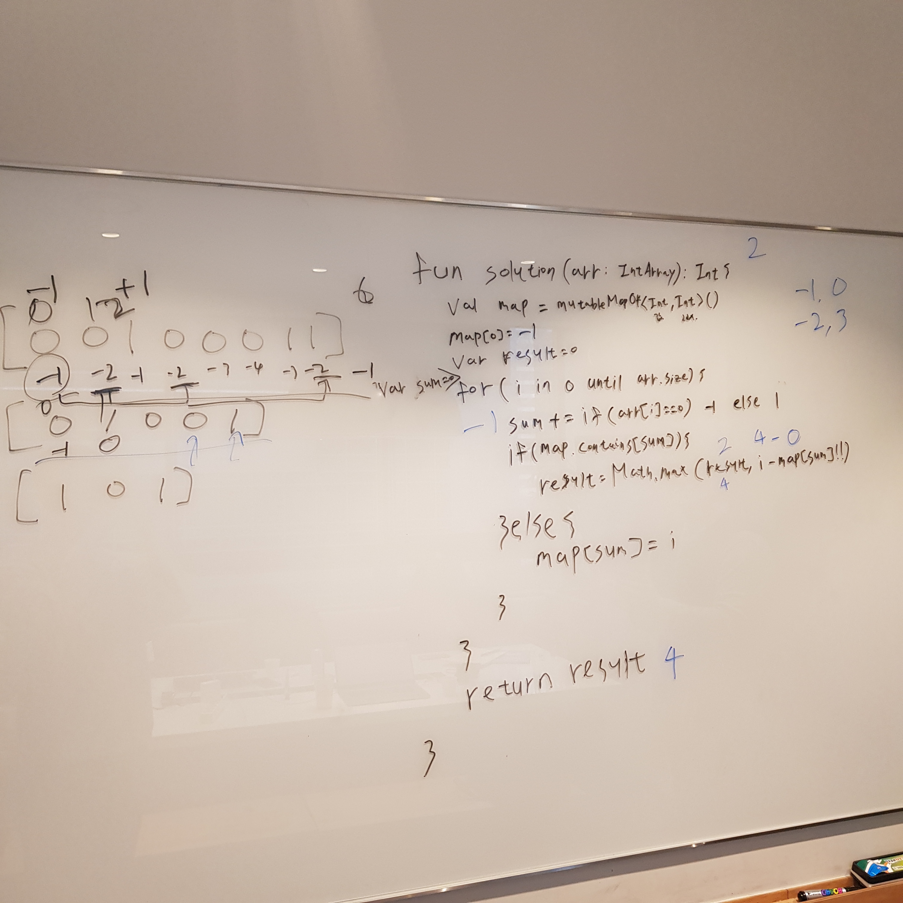

# 525. Contiguous Array

출제자: Kevin

[Contiguous Array](https://leetcode.com/problems/contiguous-array/)

- 출제 이유
  - 금요일 저녁 회사 회의실에서 혼자 풀다가 많이 헤매었던 문제라 내보았다.
  - 특별한 자료구조에 영향받지 않는 로직 문제!

---

## Latte

- 처음에 문제에 접근할 때 0과 1로 구성되고 같은 페어를 체크해야해서 +1과 -1를 각각 넣어서 0인지 체크하는지 확인했다.
- 하지만 0인지점만 체크를 하면 인덱스를 0부터 시작하는 것만 신경쓰니까 각각의 값도 맵에 넣어서 확인해봤다.
- 그리고 같은 로직으로 돌렸을 때 시작부터 같은 값인 경우 length를 구하는 코드가 별도로 들어가야해서 map[0] = -1해서 로직을 통일했다 :)

> 이거 풀고나서 나중에 확인했는데, 진짜로 안풀었던 문제였었넴 잘했다 나란녀석

---

## Kevin

- 와우..! 최단 시간내에 풀어냈다 ㅋㅋㅋㅋㅋ 아니.. 진짜로 할게 없었다.. (당황)
- 딱히 적을게 없다. 10점 만점에 10.1점
- 잘못된 시도 횟수: 0
- 요구한 힌트 갯수: 0
- 미처 채우지 못한 구멍 갯수: 0
