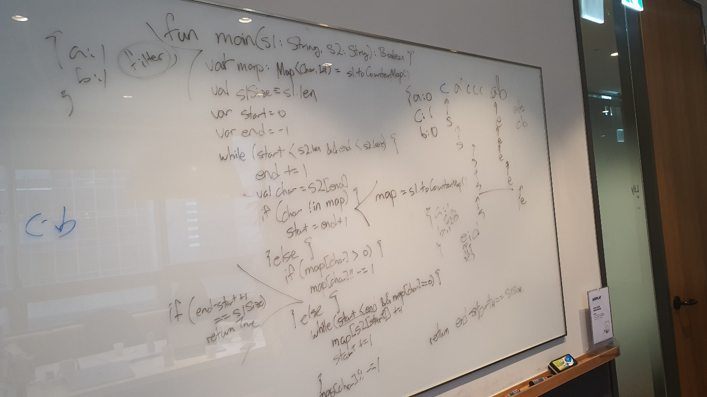

# 567. Permutation in String 

출제자: Latte

[Permutation in String](https://leetcode.com/problems/permutation-in-string/)

- 출제 이유
	-  permutation에 대한 이해도를 높일 수 있을 수 있는 문제여서 선정.
	-  솔루션이 길지 않았음.
	-  문자로 이루어진 문제에서 알파벳이 아스키코드에 매핑되어서 별도로 키맵이 필요하지 않고 그냥 IntArray를 통해서 해결할 수 있는 능력 숙지.
   

---

## Kevin


- 와~ 바로 전에 스텔라랑 테쓰가 진행했던게 거의 비슷해서 힌트를 많이 얻은 채로 시작했다!!
- map의 비교를 통해 O(mn)의 풀이까지는 곧바로 접근 가능했는데, sliding window 개념을 사용해서 O(n)까지 끌어댕겼다.
- 포인터 두개 써서 sliding window! 항상 느끼는 거지만 포인터가지고 왔다갔다 하는건 구멍의 여지가 많다!
- 시간 내로 풀어서 다행!

---

## Latte

- 맨처음에 솔루션에 접근했던 방법은 map에 캐릭터를 넣고 하나씩 빼가면서 길이를 늘려가는 방식으로 케빈과 비슷하게 풀었었다. 하지만 이 솔루션은 많은 조건문이 들어가서 읽기 쉽지 않고 별도의 메모리도 많이 사용하게된다.  

```kotlin
class Solution {
    fun checkInclusion(s1 : String, s2: String) : Boolean{
        if(s1.length > s2.length) return false
        var count = 0
        val map = IntArray(26)

        for(i in 0 until s1.length){
            map[s1[i] - 'a']++
            map[s2[i] - 'a']--
        }

        for (i in map)  if(i ==0 ) count++
        

        for (i in 0 until s2.length - s1.length) {
            val r = s2[i + s1.length] - 'a'
            val l = s2[i] - 'a'
            
            if (count == 26) return true
            
            map[r]--
            if(map[r] == 0) count++
            else if(map[r] == -1) count--

            map[l]++
            if(map[l] == 0) count++
            else if(map[l] == +1) count--
        }

        return count == 26
    }

}
```

- 이 솔루션의 키 포인트들은 다음과 같다.
1. Char-Int맵 대신에 Intarray사용하기
2. 매번 map이나 IntArray를 확인하지 않고 count를 사용해서 결과를 바로 도출.
3. length에 대한 체크를 별도로 하지 않고 왼쪽거를 빼고 오른쪽거를 늘려가면서 count만 체크할 수 있도록해서 복잡한 if else문들을 제거.
