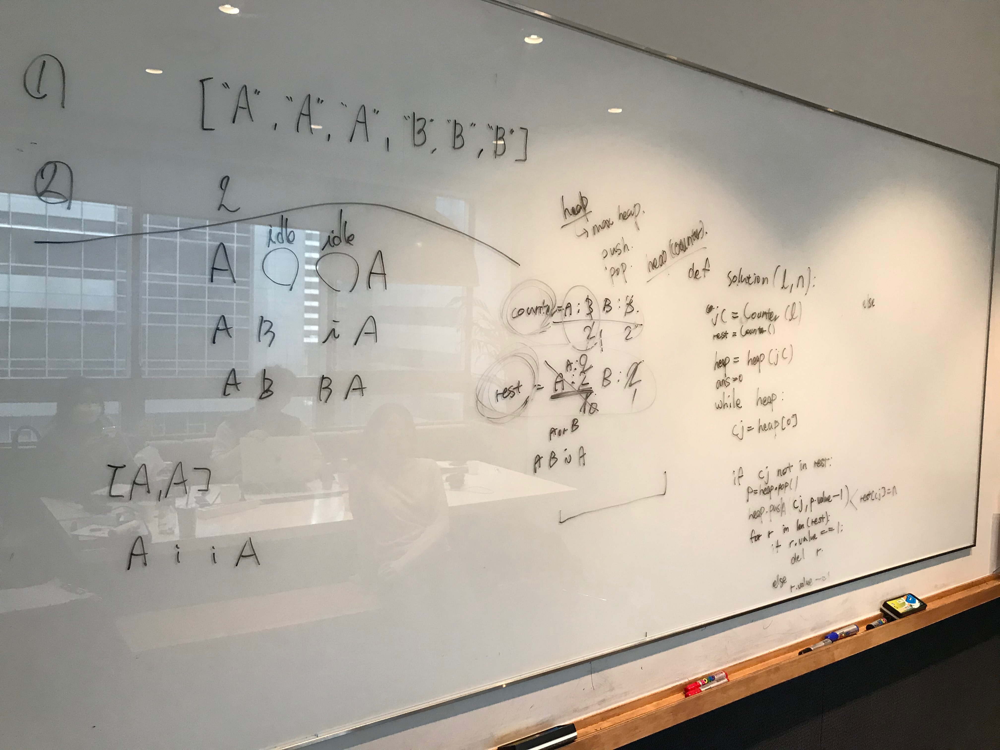

# 621. Task Scheduler 

출제자: Damian

[Task Scheduler](https://leetcode.com/problems/task-scheduler/)

- 출제 이유
  - 풀어야 하는 문제를 어떻게 정의하는 지와 (비슷한 난이도의 다른 문제에 비해) 상대적으로 복잡한 구현이 관건인 문제이다. 이런 유형의 문제도 충분히 마주할 수 있을 것 같아 골랐다.
  - 언뜻보면 몇몇 보조 자료 구조(map)을 이용하면 쉽게 구현할 수 있을 것 같다. 그러나 막상 구현하려고 하면 몇 가지 문제에 부딪힌다. 예를 들어, 어떻게 해야 현재 시점에서 가장 많이 남은 task를 쉽게 가져올 수 있을까와 같은 문제이다. map과 같은 자료구조만 이용해서는 이런 것을 할 때 많은 비효율이 생긴다. 상황에 따라 Heap와 같은 자료구조를 사용한다고 생각할 수 있는지 그리고 잘 이용할 수 있는지도 충분히 볼 수 있다.
  - 일반적인 풀이 방법(내 생각에 보다 직관적인)이 있고 정반대 방향으로 생각해서 보다 나은 효율로 풀어낼 수 있는 방법이 있다. 전자의 방법으로 깔끔하게 풀어낸다면 후자의 방법으로 사고를 유도해볼 수 있을 것 같았다.

---

## Stella


---

## Damian

- 사실 처음에 문제를 풀 때 아래에 적은 풀이처럼 깔끔히 풀진 못 했다. 그리고 나서 느낀 점은 역시 문제는 많이 풀어보는 것이 답이라는 것이다. 나올 수 있는 문제임은 분명하다. 비슷한 유형을 풀어보지 않았으면 이렇게 접근하지 못 했을 것이다. 많이 풀어보자!
- 풀이 방법 1)
  - 몇몇 질문을 통해 문제를 좀 더 정의해보자.
    - 어떤 task인지가 중요한가? 사실 중요하지 않다. 이 문제의 핵심은 최소 interval을 구하는 것이다. 실제 각 task를 나열한 배열을 만들 필요가 없다. 이 부분이 주요하다. task의 이름은 이 문제의 해답을 내는 데 중요한 요소가 아닌다.
    - 특정 시점에 task를 수행해야 한다면 어떤 task를 수행해야 할까? 현재 시점에 가장 많이 남은 task를 실행하면 된다. 아직 다음 task를 수행할 수 없는데(쉬어야 하는데) 더이상 수행할 수 있는 task가 없으면 쉬면 된다.
    - 이걸로 충분한가? 그렇지 않다. [A,A,A,A,A,A,B,C,D,E] 와 같은 경우를 생각해보자. 단순히 모든 task를 훑으며 내림 차순으로 실행을 반복할 경우엔 다음과 같은 형태가 될 것이다. (n=2), [A, B, C, D, E, A, idle, idle, A, idle ,...] 이런 경우는 최선이 아니다. 답을 구하려면 task들을 [A, B, C, A, D, E, A, idle, idle ,...] 와 같은 형태로 실행시켜야 한다. 즉, 가장 많은 갯수를 가진 task는 다른 작업과 번갈아가며 수행되게 해야 한다. 따라서 특정 시점에 가장 많은 갯수의 task가 실행되면 실행되고 n만큼의 시간이 지났을 때 다시 가장 많은 갯수의 task가 실행되도록 구현해야 한다.
  - 위의 사항들을 제대로 고민하지 않으면 문제를 풀 때 함정에 빠지기 쉽다.

```java
public int leastInterval(char[] tasks, int n) {
    if (tasks == null || tasks.length == 0) {
        return 0;
    }
    
    int[] counts = new int['Z' - 'A' + 1];
    for (char task: tasks) {
        counts[task - 'A']++;
    }
    
    PriorityQueue<Integer> maxHeap = new PriorityQueue<>(26, (a, b) -> b - a);
    for (int count : counts) {
        if (count > 0) {
            maxHeap.add(count);
        }
    }
    
    int intervals = 0;
    while (!maxHeap.isEmpty()) {
        List<Integer> temp = new ArrayList<>();
        for (int i = 0; i < n + 1; i++) {
            if (!maxHeap.isEmpty()) {
                int count = maxHeap.remove();
                if (count > 1) {
                    temp.add(count - 1);
                }
            }
            intervals++;
            if (maxHeap.isEmpty() && temp.size() == 0) {
                break;
            }
        }
        
        for (int i : temp) {
            maxHeap.add(i);
        }
    }
    return intervals;
}
```

- 풀이 방법 2)
  - 위의 방법은 앞에서부터 task들을 하나씩 실행해가며 수행 횟수를 구한 것이다. 두 번째 풀이 방법은 idle가 얼마나 필요한지 구하는 것이다.
  - 각 task 별로 수행되는 데 걸리는 시간을 위(풀이 방법 1)와 같이 구한다. 그리고 그 배열을 정렬한다. 그런 뒤 ((가장 많은 task - 1) * n)) 를 idleSlot의 기본 값으로 둔다. 가장 많은 task를 제외한 나머지 task의 갯수를 idleSlot에서 빼나간다. 배열 전체를 순회한 후 idleSlot의 값을 본다. 이 값이 0보다 작을 경우엔 task들을 잘 배열하면 별도의 idle없이 task들을 배열할 수 있다는 말이다. 따라서 tasks의 길이를 반환한다. 이 값이 0보다 클 때는 주어진 task들의 갯수와 더불어 idleSlot만큼의 idle가 추가로 필요하다는 말이다.
  - 솔직히 이렇게 생각하긴 쉽지 않을 것 같다. 그러나 기억해두고 한 번쯤 이해해두면 도움이 될 것 같다.
  - 자세한 구현은 Leetcode의 솔루션에 있다.
