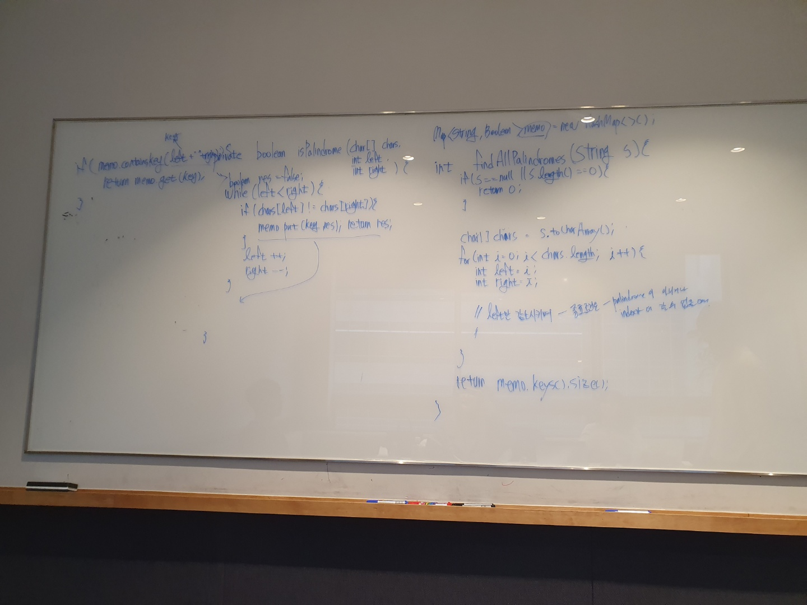

# 647. Palindromic Substrings

출제자: Tess

[Palindromic Substrings](https://leetcode.com/problems/palindromic-substrings/)

- 출제 이유
    - Palindrome 오랜만에 풀어보자 해서 골랐다!
    - 답이 여러가지가 나올 수 있어서 좋은 문제라고 생각했다.

---

## Damian


- 일단...사진에 적힌 풀이처럼 하면 문제가 풀리지 않는다. 전혀 잘못 접근했다.
- 문제를 풀며 테쓰가 준 힌트들이 있었다. 그 중에서 가운데로부터 접근해보면 어떨까라는 힌트도 있었다. 그 부분에서 중요한 점을 잘 캐치해내지 못 했다.

```
이해를 하는 데 가장 중요했던 말
By Tess,
한 문자열에서 길이가 같은 부분 문자열은 각각의 중심이 고유할 수밖에 없으니까
그 중심을 기준으로 본다는 면에서는 중복이 있지는 않을 것 같다는 생각으로
```

- Tess의 풀이가 언어와 관계 없이 이해하기 쉽게 적혀 있어서 별도로 제출한 코드를 첨부하진 않겠다.
- 이번 문제를 풀며 느꼈는데, 문제를 풀며 새로운 시도를 하는 데 겁을 많이 내는 것 같다. 최대한 알고 있는 틀 안에서 맞춰보려고 노력하는 것 같다. 나만의 문제 접근 구조를 만들어 나가는 것은 좋지만 아는 유형 내에서만 생각하려고 하면 안 되는데...그러지 않도록 노력해야겠다.
- DP로 접근하는 흥미로운 방법도 있었다.
  - https://github.com/Nideesh1/Algo/blob/master/leetcode/L_647.java
  - https://www.youtube.com/watch?v=QX8RBlXvKXg 

---
## Tess

```python
class Solution:
    def countSubstrings(self, s: str) -> int:
        length = len(s)
        answer = 0
        front = 0
        back = 0

        for i in range(length):
            front = i
            back = i
            
            # 짝수
            while (front >= 0 and back < length and s[front] == s[back]):
                answer += 1
                front -= 1
                back += 1
            
            front = i
            back = i + 1

            # 홀수
            while (front >= 0 and back < length and s[front] == s[back]):
                answer += 1
                front -= 1
                back += 1

        return answer
```

- 짝수, 홀수의 경우를 나눠서 회문을 검사하는 방식을 택했다.

- 이번에 문제를 내기 전에 단계별로 줄 힌트들을 정리해갔는데 좋은 선택이였다.
- 문제 준비하면서도 단계적으로 사고를 정리할 수 있었던 좋은 경험이였다. 
- 데미안의 문제푸는 방식을 보면서 열심히 배우는 중이다.

- 사실 이 문제는 Manacher's Algorithm 을 사용하면 O(N)으로 풀리지만, 해당 알고리즘은 예전부터 알고는 있었으나 써본적은 딱히 없다.

```python
def countSubstrings(self, S):
    def manachers(S):
        A = '@#' + '#'.join(S) + '#$'
        Z = [0] * len(A)
        center = right = 0
        for i in xrange(1, len(A) - 1):
            if i < right:
                Z[i] = min(right - i, Z[2 * center - i])
            while A[i + Z[i] + 1] == A[i - Z[i] - 1]:
                Z[i] += 1
            if i + Z[i] > right:
                center, right = i, i + Z[i]
        return Z

    return sum((v+1)/2 for v in manachers(S))
```

- [Manacher](https://blog.myungwoo.kr/56) 해당 알고리즘을 잘 정리해 둔게 있어서 링크를 남긴다!